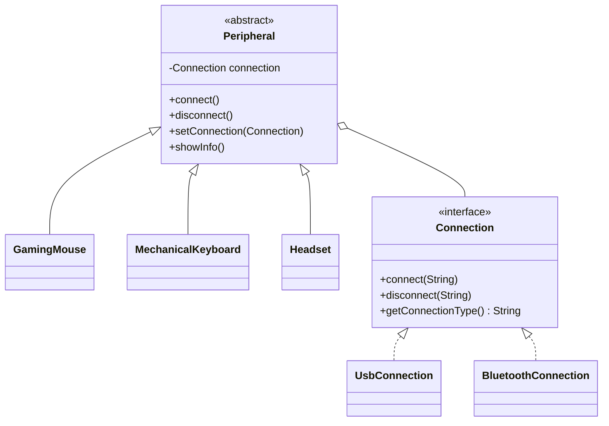

# PC Periphery Builder — Assignment 3: Bridge

Java console project for Software Design Patterns. Connection operations are simulated by console messages; the program does not control real hardware. Java 8+ JDK required. No external dependencies.

## Запуск в IntelliJ IDEA после переустановки Windows

1. Установи JDK (например, 17) и IntelliJ IDEA.
2. Распакуй архив и открой папку `PC_Periphery_Builder` через File → Open.
3. В File → Project Structure → Project выбери установленный JDK.
4. Если `src` не распознана, нажми на неё правой кнопкой → Mark Directory as → Sources Root.
5. Открой `src/pcperipherybuilder/Main.java` и нажми зелёную стрелку рядом с `main`.

Все файлы с `package pcperipherybuilder;` должны лежать в `src/pcperipherybuilder`.
На Windows можно также запустить `run.bat`, если `java` и `javac` доступны в PATH.

## Terminal

```sh
mkdir out
javac -encoding UTF-8 -d out src/pcperipherybuilder/*.java
java -cp out pcperipherybuilder.Main
```

On Linux/macOS: `bash run.sh`.

## Bridge roles

| Role | Class |
|---|---|
| Abstraction | Peripheral |
| Refined Abstractions | GamingMouse, MechanicalKeyboard, Headset |
| Implementor | Connection |
| Concrete Implementors | UsbConnection, BluetoothConnection |
| Client | Main |

`Peripheral` holds a private reference to `IConnection` and delegates `connect()` and `disconnect()` to it. Device subclasses only describe device properties. A mouse and a keyboard can each use either connection implementation; no UsbMouse or BluetoothKeyboard subclasses are needed.

The client constructs devices at runtime. It then calls `mouse.setConnection(new BluetoothConnection())` on the existing mouse. The old connection disconnects, the new connection connects, and `Same object: true` proves that the abstraction object was not replaced. A disconnected device stays disconnected when its implementation changes.

## Class diagram



## Clean Code principles and justification

1. **Separation of responsibilities / SRP.** Device subclasses store device properties; transport classes implement connection operations. Connection lifecycle is handled once in Peripheral.
2. **Meaningful names.** Peripheral, GamingMouse, Connection, and setConnection identify domain objects and actions directly.
3. **Small, focused classes and methods.** Each transport implements three short operations. Each device provides only its own details.
4. **DRY.** Common connect/disconnect/showInfo and switching logic live in Peripheral instead of being repeated across devices. Transport messages are the only implementation-specific differences; no unnecessary helper hierarchy is introduced.
5. **Open/Closed Principle.** Add a new Connection implementation without modifying Peripheral or its device subclasses. Only client composition needs to choose the new class.
6. **Depend on interfaces.** Peripheral depends on Connection, not UsbConnection or BluetoothConnection. Only Main selects concrete implementations.
7. **Encapsulation and validation.** Fields are private, model properties are immutable, null connections and invalid properties are rejected. Connected state can change only through lifecycle methods.

## Deliverable

The assignment requires a GitHub repository with complete, compiling source code. Upload this folder's contents to your repository, including src, README.md and DEFENSE.md. Do not upload out or compiled class files. This archive has not been pushed to GitHub.

The theme name is PC Periphery Builder, but this assignment implements Bridge rather than the Builder pattern. Confirm that the topic is unique in your group and was not used in the lecture.
